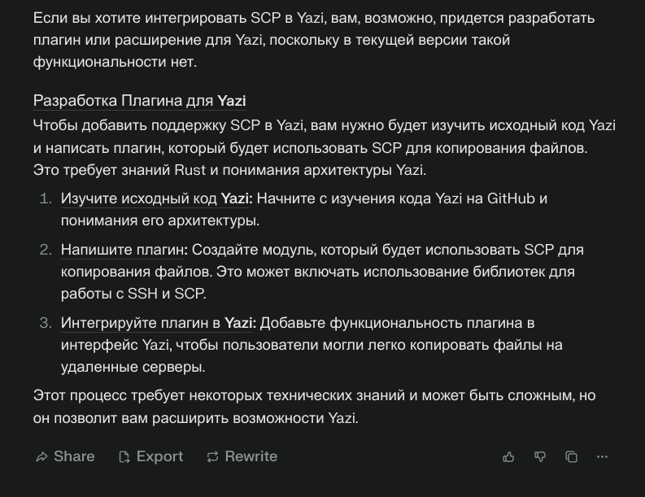
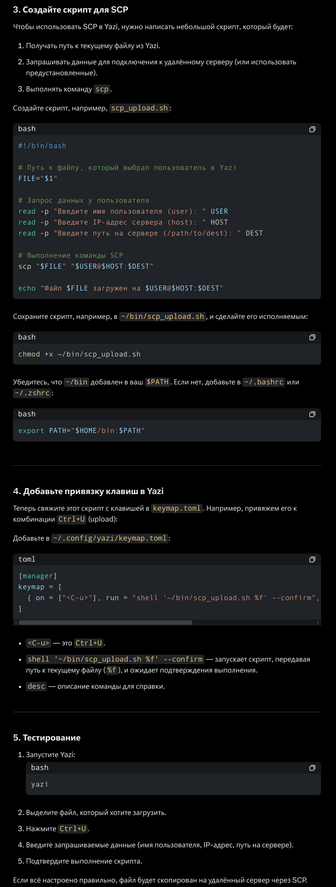
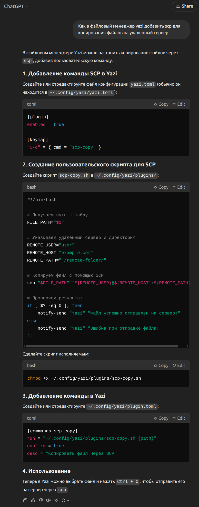

+++
title = "Попросил ИИ о помощи"
date = 2025-02-24
description = "Появилась необходимость добавить в файловый менеджер yazi, возможность через scp копировать файлы на сервер. Как проще организовать? Отвечают Perplexity, Grok, chatGPT"

[taxonomies]
tags = ["ia", "yazi", "ssh", "scp"]

[extra]
quick_navigation_buttons = true
toc = true
mermaid = false
social_media_card = "social_cards/index-post-ia.webp"
+++

Использовал Perplexity, Grok и chatGPT

## Perplexity

Этот ИИ оказался самым тупым и выдал




## Grok

Оказался поумнее




## chatGPT

Выдал примерно тоже самое, что и Grok




## Свой вариант

Но я пошел по другому пути, и добавил тупо команду в keymap.toml

```toml
[[manager.prepend_keymap]]
on = ["y", "s"]
run = '''
	shell 'scp -r -P 666 "$@" user@ip_address:/home/user && notify-send "Файл(ы) на сервер скопированы"'
'''
desc = "Скопировать файл(ы) на удаленный севрер"
```

Это просто и работает, без мозгоёбства с написанием скриптов 😁
