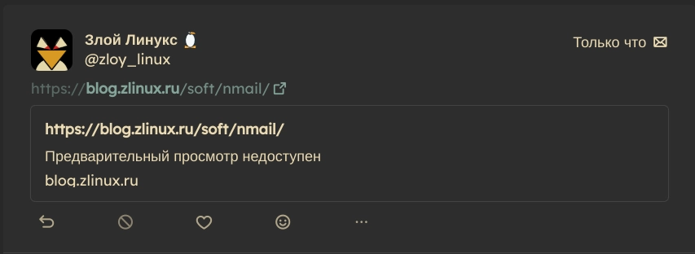
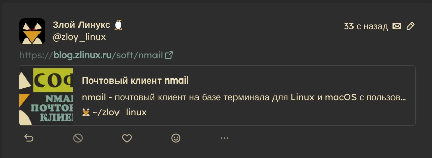

+++
title = "Разобрался с проблемой предпросмотра ссылок в sharkey"
date = 2025-03-02
description = "Некоторое время пытался понять почему некоторые ссылки имеют предпросмотр, а какие - то 'Предварительный просмотр недоступен'"

[taxonomies]
tags = ["sharkey", "dns", "server"]

[extra]
quick_navigation_buttons = true
toc = false
mermaid = false
social_media_card = "social_cards/index-post-predprosmotr.webp"
+++

## Суть проблемы

При добавлении в пост ссылки должна отображаться предварительная информация о содержимом веб-страницы, а в данном случае получалось вот это



Поначалу копался в настройках инстанса, но оказалось, проблема крылась во внутреннем DNS, который возвращал для домена локальный IP-адрес

```bash
root@zlinux# nslookup zlinux.ru
Server:		127.0.0.1
Address:	127.0.0.1#53

Name:	zlinux.ru
Address: 127.0.0.1
Name:	zlinux.ru
Address: ::1
```

Сменил DNS сервер, стало выдавать глобальный IP и всё заработало.



Поигрался с ссылками и оказалось

```
Mar 02 18:24:46 zlinux.ru pnpm[10349]: WARN *        [url-preview]        Failed to get preview of https://sl.aliexpress.ru/p?key=2eQzGQ8: StatusError: 429
Mar 02 18:25:31 zlinux.ru pnpm[10349]: WARN *        [url-preview]        Failed to get preview of https://www.ozon.ru/product/klyuch-domofonnyy: MaxRedirectsError: Redirected 10 times. Aborting.
Mar 02 18:46:12 zlinux.ru pnpm[10349]: WARN *        [url-preview]        Failed to get preview of https://www.kickstarter.com/projects/pixelfed/pixelfed-foundation-2024: StatusError: 403 Forbidden
Mar 02 18:52:06 zlinux.ru pnpm[10349]: WARN *        [url-preview]        Failed to get preview of https://www.dns-shop.ru/product/f72a537ff2cbed20/: StatusError: 401 Unauthorized
Mar 02 19:01:07 zlinux.ru pnpm[10349]: WARN *        [url-preview]        Failed to get preview of https://vk.com/iri143: StatusError: 418
```

StatusError: 429 - Слишком много запросов<br>
MaxRedirectsError - более 10 редиректов<br>
StatusError: 403 Forbidden - Доступ запрещен<br>
StatusError: 401 Unauthorized - Требуется авторизация<br>
StatusError: 418 - Шуточный код "Я чайник", но для рукожопов VK это нормально.
