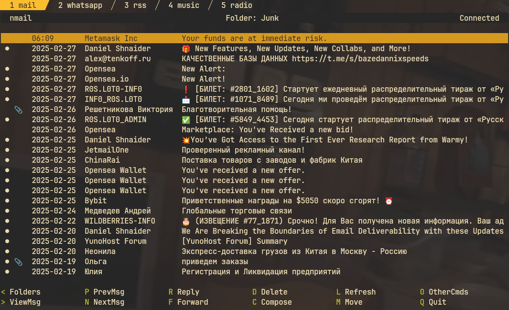

+++
title = "Почтовый клиент nmail"
date = 2025-02-28
description = "nmail - почтовый клиент на базе терминала для Linux и macOS с пользовательским интерфейсом, похожим на alpine/pine."

[taxonomies]
tags = ["terminal", "mail"]

[extra]
quick_navigation_buttons = true
toc = true
mermaid = true
social_media_card = "social_cards/index-soft-nmail.webp"
+++



## Описание

Nmail - это терминальный почтовый клиент для UNIX-подобных систем, который позволяет работать с электронной почтой через командную строку.

Nmail является мощным инструментом для работы с почтой в терминальном режиме, особенно полезным для системных администраторов и пользователей, предпочитающих работу через командную строку.

## Основные возможности

- Поддержка протоколов IMAP и SMTP
- Локальный кеш с использованием SQLite (с возможностью шифрования AES256)
- Многопоточность (получение и отправка писем выполняются в фоновом режиме)
- Автоматическое создание адресной книги на основе сообщений электронной почты
- Просмотр HTML-писем (конвертация в текст в терминале или во внешнем браузере)
- Открытие и просмотр вложений во внешней программе
- Простой мастер настройки для Gmail, iCloud и Outlook/Hotmail
- Интерфейс пользователя, аналогичный Alpine/Pine
- Создание сообщений с использованием внешнего редактора ($EDITOR)
- Просмотр сообщений с использованием внешнего средства просмотра ($PAGER)
- Сохранение и продолжение работы с черновиками сообщений
- Создание HTML-писем с использованием Markdown (см. опцию markdown_html_compose)
- Поиск писем
- Создание писем в режиме офлайн
- Настройка цветовой схемы
- Подпись

## Не поддерживается

- Локальный почтовый ящик, загруженный сторонним приложением (OfflineIMAP, fdm и т.д.)
- Несколько почтовых аккаунтов в одной сессии
- Специальную обработку меток Gmail
- Просмотр в виде потоков сообщений

## Настройка nmail для учётной записи Gmail с аутентификацией по паролю

```bash
$ nmail -s gmail
Email: example@gmail.com
Name: Firstname Lastname
Password:
Save password (y/n): y

Gmail OAuth 2.0
$ nmail -s gmail-oauth2
```

## Прочие почтовые сервисы

Запустите nmail один раз, чтобы он автоматически сгенерировал файл конфигурации по умолчанию:

```bash
$ nmail
```
Затем откройте файл config ~/.config/nmail/main.conf в текстовом редакторе и заполните необходимые поля:

```config
address=example@example.com
drafts=Drafts
imap_host=imap.example.com
imap_port=993
inbox=Inbox
name=Firstname Lastname
sent=Sent
smtp_host=smtp.example.com
smtp_port=587
trash=Trash
user=example@example.com
```

## Основные команды внутри клиента

```
<- Список папок
-> Просмотр письма / вложений
c - Написать письмо
d - удалить 
f - переслать
l - обновить список
r - ответить
m - переместить
v - просмотр в браузере
q - выйти
```

## Установка

```bash
git clone https://aur.archlinux.org/nmail.git && cd nmail
makepkg -srciA
```

## Ссылки

* GitHub: [https://github.com/d99kris/nmail](https://github.com/d99kris/nmail)
