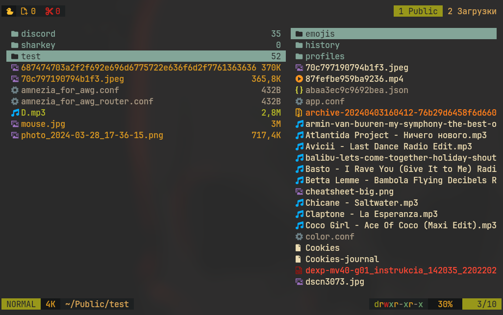

+++
title = "Файловый менеджер Yazi"
date = 2025-02-25
description = "Yazi — это современный, быстрый и настраиваемый файловый менеджер для терминала, написанный на Rust. Он поддерживает удобную навигацию, предпросмотр файлов, работу с вкладками и мощные клавиатурные сочетания, вдохновлённые ranger и nnn."

[taxonomies]
tags = ["terminal", "filemanager", "yazi"]

[extra]
quick_navigation_buttons = true
toc = true
mermaid = true
social_media_card = "social_cards/index-soft-yazi.webp"
+++

## Описание

Yazi (что означает "утка") - это файловый менеджер терминала, написанный на Rust и основанный на неблокирующем вводе-выводе async. Его цель - обеспечить эффективный, удобный и настраиваемый процесс управления файлами.

Возможности файлового менеджера Yazi 🚀

- Быстрая работа ⚡ – написан на Rust, обеспечивает мгновенную навигацию.
- Полностью клавиатурный ⌨️ – управление вдохновлено ranger и nnn.
- Предпросмотр файлов 👀 – поддержка изображений, видео, PDF, Markdown и т. д.
- Расширяемость 🔧 – возможность настройки через конфигурационные файлы и Lua-скрипты.
- Работа с вкладками 📂 – удобно переключаться между разными каталогами.
- Поддержка мыши 🖱️ – клики и прокрутка для комфортного использования.
- Интеграция с shell 🖥️ – выполнение команд прямо в менеджере.
- Поддержка плагинов 🛠️ – легко расширяется под твои задачи.
- Многофункциональный поиск 🔍 – фильтрация, навигация и быстрый доступ к файлам.
- SCP и другие протоколы 🌐 – можно настроить для удалённой работы с файлами.




## Установка

```bash
sudo pacman -S yazi
```

## Ссылки
  
  
  
* GitHub: [https://github.com/sxyazi/yazi](https://github.com/sxyazi/yazi)
* Документация: [https://yazi-rs.github.io](https://yazi-rs.github.io)
